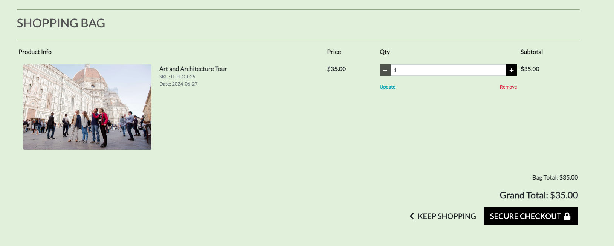

# Testing

Return back to the [readme.md](readme.md) file.

## Code Validation

### HTML

I have used the recommended [HTML W3C Validator](https://validator.w3.org) to validate all of my HTML files and used the [Validate by uri](https://validator.w3.org/#validate_by_uri) for the live pages.

| Page | W3C URL | Screenshot | Notes |
| --- | --- | --- | --- |
| Home | [W3C](https://validator.w3.org/nu/?doc=https%3A%2F%2Foff-the-beaten-track-b019d3277c26.herokuapp.com%2F) |  | Pass: No Errors|
| Activity | [W3C](https://validator.w3.org/nu/?doc=https%3A%2F%2Foff-the-beaten-track-b019d3277c26.herokuapp.com%2Factivity) |  | Pass: No Errors |
| Bag | [W3C](https://validator.w3.org/nu/?doc=https%3A%2F%2Foff-the-beaten-track-b019d3277c26.herokuapp.com%2Fbag) |  | Pass: No Errors |
| Checkout | [W3C](https://validator.w3.org/nu/?doc=https%3A%2F%2Foff-the-beaten-track-b019d3277c26.herokuapp.com%2Fcheckout) |  | Pass: No Errors |

### CSS

I have used the recommended [CSS Jigsaw Validator](https://jigsaw.w3.org/css-validator) to validate all of my CSS files.

| File | Jigsaw URL | Screenshot | Notes |
| --- | --- | --- | --- |
| base.css | [Jigsaw](https://jigsaw.w3.org/css-validator/validator?uri=https%3A%2F%2Foff-the-beaten-track-b019d3277c26.herokuapp.com%2F&profile=css3svg&usermedium=all&warning=1&vextwarning=&lang=en) |  | Pass: No Errors |

### JavaScript

I have used the recommended [JShint Validator](https://jshint.com) to validate all of my JS files.

| File | Screenshot | Notes |
| --- | --- | --- |
| stripe_elements.js |  | Undefined Stripe variable - external library |
| countryfield.js |  | Let is available in ES6 |

### Python

I have used the recommended [PEP8 CI Python Linter](https://pep8ci.herokuapp.com) to validate all of my Python files.

| File | CI URL | Screenshot | Notes |
| --- | --- | --- | --- |
| Activity views.py |  | Pass: No Errors |
| Bag views.py |  | Line 67 and 68 - Line too long |
| Checkout views.py |  | Pass: No Errors  |
| Profiles views.py |  | Pass: No Errors  |
| SETTINGS.py |  | Line 143-146 too long  |
| Activity forms.py |  | Pass: No Errors |
| Checkout forms.py |  | Pass: No Errors |
| Profile forms.py |  | Line 33 too long |
| Activity models.py |  | Line 34/52 too long |

## Browser Compatibility

I've tested my deployed project on multiple browsers to check for compatibility issues.
The browsers tested include:
- [Chrome](https://www.google.com/chrome)
- [Firefox (Developer Edition)](https://www.mozilla.org/firefox/developer)
- [Safari](https://support.apple.com/downloads/safari)
- [Brave](https://brave.com/download)

## Responsiveness

I've tested my deployed project on multiple devices to check for responsiveness issues.

| Device | Home | Activity | Activity Detail | Reviews | Checkout | Notes |
| --- | --- | --- | --- | --- | --- | --- |
| Mobile (DevTools - iPhone 14) |  |  |  |  | | Works as expected |
| Tablet (iPad Pro) |  |  |  |  |  | Works as expected |
| Desktop |  |  |  |  | |  Works as expected |
| XL Monitor |  |  |  |  |  | Scaling starts to have minor issues |

## Lighthouse Audit

I've tested my deployed project using the Lighthouse Audit tool to check for any major issues.

| Page | Mobile | Desktop | Notes |
| --- | --- | --- | --- |
| home |  |  |
| Activity |  |  |
| Activity Details |  |  |
| Reviews |  |  |
| Bag |  |  |
| Checkout |  |  |

## Defensive Programming

Defensive programming was manually tested with the below user acceptance testing:

| Page | Expectation | Test | Result | Fix | Screenshot |
| --- | --- | --- | --- | --- | --- |
| Home | | | | | |
| | Page is expected to open the signup/login page when the user does clicks on 'My Profile'. | Tested the feature by clicking on 'My Profile'  | The feature behaved as expected, and it did open to the signup/login page | Test concluded and passed |  |
| | Search bar is expected to return results that include keywords whne searched | Tested the feature by searching various words | The feature behaved as expected. | Test concluded and passed |  |
| Navigation - All Pages | | | | | |
| | Navigation links are expected to do take the user to the correct page when the user does clicks on them | Tested the feature by clicking on links and checking which pages open | The feature behaved as expected, and opened correct pages| Test concluded and passed |  |
| | Feature is expected to go to the shopping bag when clicked | Tested the feature by clicking on the bag | The feature worked as expected. | Test concluded and passed |  |
| Shopping Bag | | | | | |
| | Feature is expected to add, remove and delete items in the bag | Tested the feature by adding items to the bag, change the numbeer of items and delete items | The feature worked as expected. | Test concluded and passed |  |
| Add Review | | | | | |
| | Feature is expected to add a review to an activity | Tested the feature by adding a review to an activity through the form | The feature worked as expected. | Test concluded and passed |  |
| Checkout | | | | | |
| | Feature is expected to allow the user to purchase an activity | Tested the feature by completing checkout form process | The feature worked as expected. | Test concluded and passed |  |
| Admin Panel | | | | | |
| | Feature is expected to allow the admin user to manage order details of customers | Tested the feature by changing quantities and deleting items from order| The feature worked as expected. | Test concluded and passed |  |
| | Feature is expected to allow administrator to have access to various tables such as orders, activity, reviews, to give the admin the ability to add and delete activities and reviews  | Tested the feature by adding, editing, and removal of activities and reviews | The feature worked as expected.| Test concluded and passed |  |

Some other tests were conducted which include results below:

| Page | User Action | Expected Result | Pass/Fail | Comments |
| --- | --- | --- | --- | --- |
| Home | | | | |
| | Click on Logo | Redirection to Home page | Pass | |
| | Click on Home link in navbar | Redirection to Home page | Pass | |
| Navigation | | | | |
| | Click on any link in navbar | Redirection to all pages | Pass | |
| | Search bar | Searches work as expected | Pass | |
| Sign Up | | | | |
| | Click on Sign Up button | Redirection to Sign Up page | Pass | |
| | Enter valid email address | Field will only accept email address format | Pass | |
| | Enter valid password (twice) | Field will only accept password format | Pass | |
| | Click on Sign Up button | Asks user to confirm email page | Pass | Email sent to user |
| | Confirm email | Redirects user to a page encouraging them to confirm their email | Pass | |
| Log In | | | | |
| | Click on the Login link | Redirection to Login page | Pass | |
| | Enter valid email address | Field will only accept email address format | Pass | |
| | Enter valid password | Field will only accept password format | Pass | |
| | Click Login button | Redirects user to home page | Pass | |
| Log Out | | | | |
| | Click Logout button | Redirects user to logout page | Pass | Confirms logout first |
| | Click Confirm Logout button | Redirects user to home page | Pass | |
| Profile | | | | |
| | Click on Profile button | User will be redirected to the Profile page | Pass | |
| | Click on the Edit button | User will be redirected to the edit profile page | Pass | |
| | Click on the My Orders link | User will be redirected to the My Orders page | Pass | |
| | Brute forcing the URL to get to another user's profile | User should be given an error | Pass | Redirects user back to own profile |
| Activity | | | | |
| | Click on activity image | User will be redirected to the Activity Details page | Pass | |
| Product Details | | | | |
| | Click on + / - button to add/remove product from bag | Quantity in bag will increase/decrease | Pass | |
| | Click on add to bag button to add product to bag | Item will be added to bag | Pass | |
| | Click on keep shopping button to add product to bag | Item will be added to bag | Pass | |

## Unit Testing

Unit testing was used to check the validity of forms, a few selected functions and http responses, results are shown below.

| Page | User Action | Expected Result | Pass/Fail |
| --- | --- | --- | --- |
| Home | | | | | |
| | Page is expected to open and render correctly. | Tested using test_homepage function in test_views.py in the Home app   | The feature behaved as expected, and it did render correctly | Test concluded and passed |
| Home | | | | | |
| | Activity expected to be added to bag. | Tested using test_add_to_bag function in test_views.py in the Home app   | The feature behaved as expected, and added the item to the bag | Test concluded and passed |
| Checkout | | | | | |
| | Order form input tested for validity. | Tested using test_order_form_invalid function in test_forms.py | The feature behaved as expected, however optional fields caused a valid result | Test concluded and passed |

## User Story Testing

| User Story | Screenshot |
| --- | --- |
| As a new user, I want to create an account and set up my profile, so that I can store my order details and preferences securely, enhancing my shopping experience. |  |
| As a user, I want to easily browse, search, and sort through various candles and wax melts, so that I can quickly find products that match my preferences and improve my shopping experience. |  |
| As a user, I want clear navigation elements and interactive buttons, so that I can easily move between sections/pages and perform actions efficiently, enhancing my overall experience on the site. |  |
| As an administrator, I want to manage products effectively by adding new items, updating details, and removing discontinued products, so that I can keep the inventory fresh and relevant for users. |  |
| As a user, I want to manage my shopping bag by adding, editing, or removing items before checkout, so that I can review and adjust my orders conveniently, ensuring a smooth purchasing process. |  |
| As an administrator, I want access to a dashboard to manage various aspects of the website, including products, user profiles, orders, FAQs, and newsletter subscribers, so that I can efficiently oversee and maintain the site for optimal performance and user experience. |  |

## Bugs

- Responsiveness issues on homepage with hero-message not displaying correctly on mobile devices.

    - To fix this, I adjusted the css margins to fit the specific screen size.

- Some images appeared stretched on the activity details page

    - To fix this, I adjusted the css on specific pages to ensure it rendered correctly. 

## Unfixed Bugs

- Through checkout process, the screen renders the checkout page, minus the form, while the checkout is processing. It then moves to checkout success.

- On devices smaller than 375px, the page starts to have `overflow-x` scrolling.

    - Attempted fix: I tried to add additional media queries to handle this, but things started becoming too small to read.
